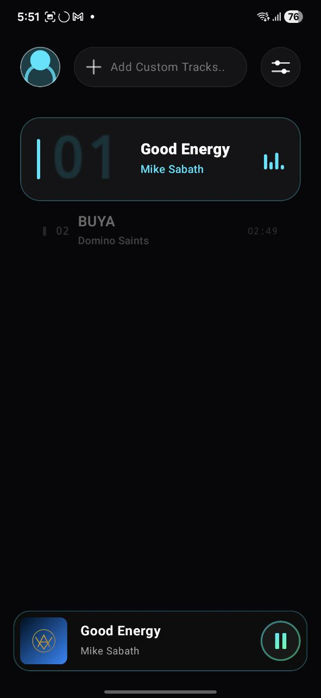
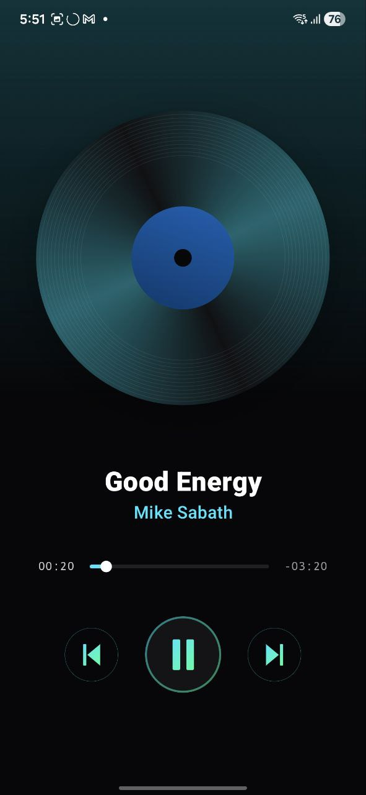
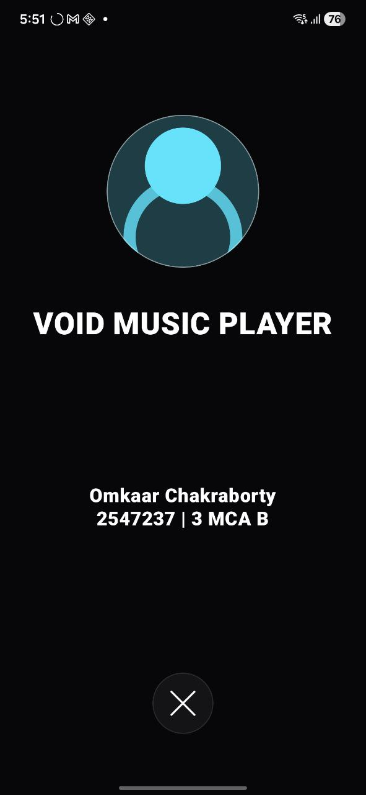

# VOID Music Player 🎵

VOID Music Player is a modern, high-performance Android music player built entirely with **Jetpack Compose**. It features a stunning glassmorphic UI, dynamic theme transitions, and smooth shared-element animations to provide a premium listening experience.

## ✨ Features

*   **Glassmorphic Design:** A sleek, semi-transparent UI with blurred backgrounds and glass-like surfaces.
*   **Dynamic Theming:** The app's ambient colors and gradients automatically adapt to the currently playing track.
*   **Smooth Animations:** Utilizes Jetpack Compose's `SharedTransitionLayout` for seamless transitions between the playlist and the player view.
*   **Vinyl Experience:** Features a custom-built interactive Vinyl Record component that rotates during playback.
*   **Audio Visualizer:** Real-time visual feedback for your music.
*   **Local Library Support:** Easily pick and play audio files directly from your device storage.
*   **Edge-to-Edge Experience:** Fully immersive UI that utilizes the entire screen.

## 🛠 Tech Stack

*   **Language:** Kotlin
*   **UI Framework:** Jetpack Compose
*   **Design System:** Material 3
*   **Media Handling:** Android `MediaPlayer` & `MediaMetadataRetriever`
*   **Animations:** Compose Animation (Shared Element Transitions, Physics-based springs)
*   **Architecture:** State-driven UI with Coroutines for asynchronous tasks.

## 📸 Screenshots

<p align="center">
  
  
  
</p>

[//]: # (> **Note:** Place `playlist.jpg`, `player.jpg`, and `visualizer.jpg` inside the `screenshots` folder to see them here.)

## 🚀 Getting Started

### Prerequisites
*   Android Studio Ladybug (or newer)
*   Android SDK 34+
*   A physical device or emulator running Android 8.0 (API 26) or higher.

### Installation
1.  Clone the repository:
    ```bash
    git clone https://github.com/your-username/FunMusicPlayer.git
    ```
2.  Open the project in Android Studio.
3.  Sync Gradle and build the project.
4.  Run the app on your device.

## 📂 Project Structure

*   `mains/`: Contains the `MainActivity` and core screen orchestration.
*   `sharedComponents/`: Reusable UI elements like `VinylRecord`, `AudioVisualizer`, and `GlassHeader`.
*   `mediaControls/`: Logic and UI for playback controls.
*   `ui/theme/`: Custom themes, colors (VoidBlack, GlassSurface), and typography.

## ❤️ Special Thanks & Credits

This project was inspired by the creative work of the Android community. Special thanks to:

*   **[Kyriakos Georgiopoulos](https://gist.github.com/Kyriakos-Georgiopoulos)** - For the exceptional UI design concepts and glassmorphism implementation ideas that served as the foundation for this player's aesthetic.

## 📄 License

This project is licensed under the MIT License - see the [LICENSE](LICENSE) file for details.

---
*Created with ❤️ for music lovers.*
